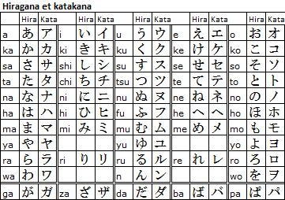

# Créer un Karaoké Toyunda Mugen

Bien le bonjour ! Votre générique préféré n'est pas dans la base Toyunda Mugen et ça vous rend très triste ?

**Deux solutions :** soit vous déposez une *issue* via le [formulaire](https://lab.shelter.moe/toyundamugen/times/issues/new) avec le template "*Suggestion de Kara*", et espérez qu'un mécène fasse le travail... Soit vous le réalisez vous-même ! C'est simple, et on va tout vous expliquer dans ce tutoriel. Allez, c'est parti ! :)

## Se préparer

### Installer Aegisub
Pour réaliser des *Karaokés* et même des *sous-titres* de façon générale, vous aurez besoin du logiciel **Aegisub**. Vous pouvez télécharger une **installation complète** *(full install)* ou une **installation portable** *(portable version)* via la page [Téléchargements](http://www.aegisub.org/downloads) du [site officiel](http://www.aegisub.org).

### Trouver une bonne source vidéo
Il pourrait être tentant d'inclure dans la base la première vidéo YouTube qui passe. Cependant, la qualité n'est pas forcément au rendez-vous, ou bien le titre est tout simplement introuvable. Dans le cas d'*animés* récents, il serait même préférable d'inclure une vidéo qui soit *creditless* (sans crédits), et au minimum en 720p. Il vous faudra donc une source DVD / Blu-Ray.

**Plusieurs solutions s'offrent à vous :**

* **Trouver un *rip* sur les interwebs** : faut-il encore présenter [NyaaTorrents](http://nyaa.si) ? Si vous avez un compte [Asian DVD Club](https://asiandvdclub.org), ça peut aussi vous aider. Et globalement, ***Google est votre ami***.

* **Demander aux potos** : si ce n'est pas déjà fait, rejoignez le Discord [*Le Eden de la Nanami*](https://discordapp.com/invite/a8dMYek) ! Et n'hésitez pas à demander aux habitués du canal *#karaoke* s'ils ont la chanson dans leur base personnelle !

* **Faire un rip vous-mêmes** : eh ouais, il faut parfois donner de sa personne. Certains DVD & Blu-Ray français contiennent les génériques sans crédits, mais c'est surtout le cas sur les volumes japonais. Il est possible de s'en procurer via [CD Japan](http://www.cdjapan.co.jp), en occasion sur [Mandarake](https://mandarake.co.jp)  ou encore tout bêtement sur [Amazon Japan](http://amazon.co.jp). Une fois que vous avez ça, il vous faut un lecteur DVD ou Blu-Ray pour PC, selon le support à ripper *(merci Captain Obvious !)*. Pour vous permettre de lire correctement les disques et de copier-coller les flux qui vous intéressent, je vous conseille le logiciel *DVD Fab Passkey* [(site officiel)](http://fr.dvdfab.cn/passkey-lite.htm)... [(et lien moins officiel)](https://mega.nz/#!tR5GVCRA!1HacBl2VOq-ee-oFOaZ285KXCr-NEJV5KSj8EceHL4A). Le disque obtenu et le flux extrait, on va le **réencoder** pour le **compresser** un peu, et obtenir un bon vieux fichier **MP4** plutôt qu'un flux *m2ts* ou *VOB*. Y a plusieurs écoles, mais je vous conseille de jeter un œil à [MeGUI](https://sourceforge.net/projects/megui/). 

### Trouver les "vraies" paroles
Sujet plus délicat qu'il n'y paraît, tant les transcriptions à l'oreille foisonnent sur Internet. Si plusieurs sources fiables sont d'accord entre-elles, on peut se dire que c'est bon. Autrement, il va falloir mener des enquêtes approfondies : bien souvent, en faisant soi-même une transcription à partir du livret officiel du CD où la chanson est parue. L'exercice peut être fastidieux si vous n'avez jamais appris vos kanas japonais, mais reste faisable à l'aide de ce tableau :

Si vous ne reconnaissez pas un kanji, le site http://maggie.ocrgrid.org/nhocr/ peut vous aider à le OCR ("numériser") pour le passer dans Google Traduction ou autre.

***Attention à bien respecter ces règles sur la romajisation des paroles :***

* Les mots non japonais doivent être mis en majuscules (si Karaoké non-japonais, ce n'est pas conseillé).
* Les particules doivent être retranscrite wa, wo, he (et non wa, o, e).
* Les voyelles longues comme "ou" sont notées ainsi et non avec un macaron ou un accent circonflexe.
* Ne pas mettre de majuscules au début des phrases (sauf dans un karaoke non japonais).
* Ne pas mettre de ponctuation.
* Mettre une majuscule pour les noms propres.