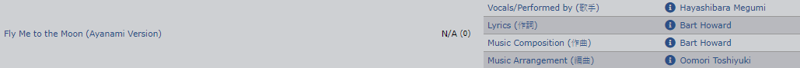

# Le fichier .kara

C'est un fichier de métadonnées pour votre karaoké, il est primordial : il indique à **Karaoke Mugen** où sont les fichiers à utiliser ainsi que d'autres infos pour générer sa base de données.

## Exemple de .kara

### Nom du fichier

Prenons par exemple le fichier `.kara` suivant :

```
JAP - 3-gatsu no Lion - OP1 - Answer.kara
```

Il s'agit de l'opening japonais de la série "3-gatsu no Lion", une adaptation d'un excellent manga de Chica Umino.

Pour plus d'informations sur comment nommer vos fichiers, consultez le [tutorial de création de karaoké disponible sur le dépot de la base](naming.md).

### Le contenu du fichier .kara

Reprenons notre exemple de l'OP de "3-gatsu no Lion".

```
videofile=JAP - 3-gatsu no Lion - OP1 - Answer.mkv
subfile=JAP - 3-gatsu no Lion - OP1 - Answer.ass
subchecksum=abcdef12345678910
year=2016
singer=BUMP OF CHICKEN
tags=TAG_ANIME,TAG_TVSHOW
songwriter=Motoo Fujiwara
creator=Shaft
author=Bakaclub
series=3-gatsu no Lion
title=Answer
type=OP
order=1
lang=jpn
KID=fcb32b00-c7d5-470e-9f98-32edd1b67e18
videosize=44241053
videoduration=89
videogain=-2.18
version=2
```

N'ayez pas peur, tout n'est pas à remplir par vous-même (mais une grande partie si quand même).

- `videofile` : Nom du fichier vidéo, obligatoire, tel qu'on le trouve dans le répertoire `app/data/videos`.
- `subfile` : Nom du fichier de sous-titrage des paroles, obligatoire aussi et tel qu'on le trouve dans le répertoire `app/data/lyrics`.
  - Si aucun fichier requis, indiquez `dummy.ass` (par exemple si votre vidéo contient des sous-titres embarqués ou incrustés).
- `year` : Année de production de la série/vidéo.
- `singer` : Chanteur/euse, ou groupe qui chante. Si plusieurs chanteurs, séparer par des virgules. L'ordre est "**prénom** puis **nom**".
- `tags` : Une liste de tags séparés par des virgules, pouvant servir à mieux catégoriser votre karoaké. [Consultez la liste des tags](tags.md)  
- `songwriter` : Nom du ou des compositeurs. Séparer par des virgules si plusieurs compositeurs. L'ordre est "**prénom** puis **nom**".
- `creator` : Nom de l'entité qui a crée la série/vidéo. Studio d'animation ou boîte de production selon les cas.
- `author` : C'est vous ! Mettez votre pseudonyme pour montrer à la terre entière que vous avez écrit un karaoké !
  - Si vous avez beaucoup retouché un karaoké existant, ne soyez pas timide et ajoutez-vous au champ `author` en plus de l'auteur original.
- `series` : Nom de la série dont le karaoké est tiré. Si vous faites le karaoké d'une vidéo musicale ou d'un live en relation avec un animé, par exemple le clip de *Zen Zen Zense* de *RADWIMPS* alors indiquez *Your Name* dans `series`.
- `title` : Titre de la chanson
- `type` : L'un des types suivants :
  - `AMV` : Anime Music Video. Montages amateurs autour d'animés.
    - S'il s'agit d'une vidéo musicale animée mais officielle, choisissez plutôt `MV`.
  - `CM` : Publicité.
  - `ED` : Ending d'un animé.
  - `IN` : Insert song (chanson qui passe en plein milieu d'un épisode).
  - `OT` : Autre/inclassable.
  - `PV` : Vidéo promotionnelle (trailer, bande-annonce, etc.).
  - `LIVE` : Concerts.
  - `OP` : Opening d'un animé.
  - `MV` : Vidéo musicale (clips musicaux).
- `order` : Numéro de l'opening/ending. Doit être laissé vide si la série ne contient qu'un opening/ending.
- `lang` : Indiquer le code ISO639-2B sur 3 caractères de la langue. Pour connaître la liste des langues de cette norme, consultez [l'article Wikipédia à son sujet](https://fr.wikipedia.org/wiki/Liste_des_codes_ISO_639-2) ! Par exemple, le code ISO639-2B du japonais est `jpn`.
- `version` : Format du .kara (version 2)

Les lignes suivantes sont remplies automatiquement par **Karaoke Mugen** lors de la génération, vous n'avez donc pas à vous en préoccuper, mais pour l'exhaustivité nous allons expliquer à quoi elles servent. Attention, si vous modifiez le fichier vidéo d'un karaoké, ces valeurs seront modifiées automatiquement lors de la génération de la base de données (ou au lancement du logiciel).

- `KID` : Il s'agit d'un identifiant unique (UUID) permettant d'identifier le karaoké dans la base de données. Ainsi, quand vous passez une playlist à quelqu'un, ou que vous régénérez la base, les playlists retrouveront leurs karaokés dans la base de données. **Si deux karaokés ont le même `KID`, l'univers peut imploser, donc attention : modifier cette valeur au hasard est le meilleur moyen de corrompre votre base de données.**
- `subchecksum` : Permet à Karaoke Mugen de savoir si le fichier des sous-titres a chagné.
- `videosize` : Taille en octets de la vidéo, cela permet à **Karaoke Mugen** de repérer si vous avez remplacé le fichier vidéo. Si c'est le cas, la base de données sera regénérée et les valeurs suivantes recalculées.
- `videogain` : Gain audio de la vidéo. Il est calculé lors de la génération via *FFMPEG*. Cela permet d'égaliser le son de toutes les vidéos de votre base de données pour éviter les sursauts de changement de volume lors du passage d'une chanson à l'autre.
- `videoduration` : Détecté aussi lors de la génération de la base de données, il permet de savoir combien de temps en secondes dure la vidéo. Cette valeur permet ensuite de gérer l'animation de la barre de progression sur l'interface utilisateur.
- `dateadded` : Date d'ajout dans la base de données
- `datemodif` : Date de dernière modification

#### Lorsque vous créez un nouveau .kara en prenant un autre .kara comme modèle

Supprimez les lignes suivantes pour qu'elles soient regénérées :

- `kid`
- `dateadded`

Les données vidéo seront regénérées toute seules si une modification est détectée.

#### Protips de remplissage de .kara

Tout d'abord, quand vous remplissez le .kara, il est important d'avoir de bonnes références pour ne pas se tromper sur les artistes / chanteurs / compositeurs / studio / etc.

##### Références

- Pour les .karas d'animes, on se référera sur :
  - [MyAnimeList](http://myanimelist.net/)
  - [anidb](https://anidb.net/) (onglet _songs_, après la section _Anime Tags_)
- Pour les .karas de Visual Novel :
  - [vndb](https://vndb.org/)
- Pour les jeux vidéo :
  - [vgmdb](http://vgmdb.net/)

Si vraiment vous galérez à trouver une info en particulier, Google, NicoNico, ou Internet de manière générale restent de très bons alliés. Il y a des infos, comme par exemple des auteurs d'AMV des années 2000 qui sont difficiles à trouver. On ne vous fouettera pas sur la place publique si vous ne remplissez pas toutes les informations.

##### Normes des noms

Lors du remplissage, merci de toujours noter les personnes impliqués dans cet ordre : **[Prénom] [Nom]**

Par exemple :

- Hatsune Miku / Megurine Luka / Kagamine Len ✖
- **Miku Hatsune / Luka Megurine / Len Kagamine** ✔
- Ayanami Rei / Shinkai Makoto / Nagato Yuki ✖
- **Rei Ayanami / Makoto Shinkai / Yuki Nagato** ✔

Comment ne pas se tromper ?

Sur MyAnimeList, le nom des artistes / personnages sont toujours notés comme suit : **[Nom], [Prénom]**

[Ceci est un exemple](https://myanimelist.net/people/1117) où il suffit juste d'inverser.

Sur anidb c'est la même chose : **[Nom] [Prénom]**



La bonne réponse est Megumi Hayashibara, donc.

Enfin, dans un souci d'harmonisation des artistes, vous êtes prié de respecter les rêgles suivantes :

- Un nom avec un "a" long (aa) devient "â"
- Un nom avec un "i" long (ii) reste "ii"
- Un nom avec un "u" long (uu) devient "û"
- Un nom avec un "e" long (ee) devient "ê"
- Un nom avec un "o" long (ou) devient "ô"

Par exemple, "Chiwa Saitou" sur anidb devient "Chiwa Saitô" dans le .kara.

##### Normes de nommage des noms de fichiers

Si vous voyez un .kara (donc une vidéo) qui porte un nom inexact, vous pouvez tout à fait le renommer. Mais **ATTENTION**, il faut tout renommer :

- **le nom du .kara en lui-même** (machin.kara -> truc.kara)
- **les données dans ledit .kara** (à savoir les lignes "videofile" et "subfile")
- **le .ass** (que vous venez à l'instant de renommer dans le .kara avec "subfile")

Mais ce n'est pas encore complètement terminé, car il reste à renommer la vidéo. Pour ça, [demandez sur Discord dans le canal #karaoke](https://discord.gg/a8dMYek) de vous donner un accès au ftp pour renommer vous-même les vidéos.

##### Les noms alternatifs de séries

Si, pendant vos merveilleuses sessions de remplissage ou lors de la création d'un .kara , vous trouvez des nom alternatifs de série, [rajoutez-les à la base de noms alternatifs déjà existante](altnames.md).

Par exemple si vous connaissez le nom anglais ou français ou espagnol d'une série, vous pouvez remplir le fichier `series.json` en suivant les instructions du lien ci-dessus.

##### Le champ `creator`

Petit point sur la partie « Creator » :

Nock [a fait un tableau](https://docs.google.com/spreadsheets/d/1ULoVCi7UvTG0qSMVUhnPLOOiehH5jVrVYZMsuYi9O7s/edit#gid=18648527
) de la majorité des studios d'animation / de jeux vidéo / de toku / de films live, avec leur nom **officiel**. Servez-vous en de référence pour remplir la ligne « Creator » des .karas, par exemple n'écrivez pas **Shaft**, mais **SHAFT**. Cela évite que la base de données interprète cela comme deux noms de studio différents.

##### Les bons réflexes

comme la grosse majorité des .karas que vous allez remplir proviennent de séries TV japonaise, par réflexe, n'oubliez pas le petit «TAG_ANIME,TAG_TVSHOW» dans la ligne `tag`.

### Valider un .kara par Karaoke Mugen

Pour valider et générer votre fichier .kara, placez les fichiers dans des dossiers de **Karaoke Mugen** :

- `app/data/karas` : Le fichier .kara
- `app/data/lyrics` : Le fichier .ass
- `app/data/videos` : Le fichier vidéo

Vous devez alors générer une nouvelle base par le logiciel. Pour cela plusieurs options :

- Supprimez le fichier `karas.sqlite3` dans le dossier `app/db`, **Karaoke Mugen** détectera son absence et en créera un nouveau à partir du contenu de `app/data`. Si une erreur se produit vous en serez informé dans la fenêtre du logiciel.
- Lancez **Karaoke Mugen** en ligne de commande avec l'option `--generate` (2.0.x et supérieur) ou `--validate` (2.1).
  - `--generate` crée une nouvelle base de données, utile si vous voulez tester votre kara dans l'application
  - `--validate` ne fait que valider les .karas et les complèter sans toucher à votre base. Utile si vous voulez aller vite.
- Si **Karaoke Mugen** est déjà lancé, depuis le panneau d'administration cliquez sur **Regenerate database** dans l'onglet **Database**.

#### S'il y a un problème

Votre .kara est défectueux ? Repérez le message d'erreur dans la console, il devrait vous indiquer ce qu'il manque / ne va pas. 

[Consultez la FAQ](faq.md) et N'hésitez pas à [venir sur Discord](https://discord.gg/a8dMYek) dans le canal *#karaoke* pour demander de l'aide.

#### Si tout se passe bien

Félicitations, vous avez un .kara en bonne et dûe forme !
