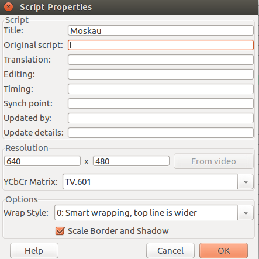
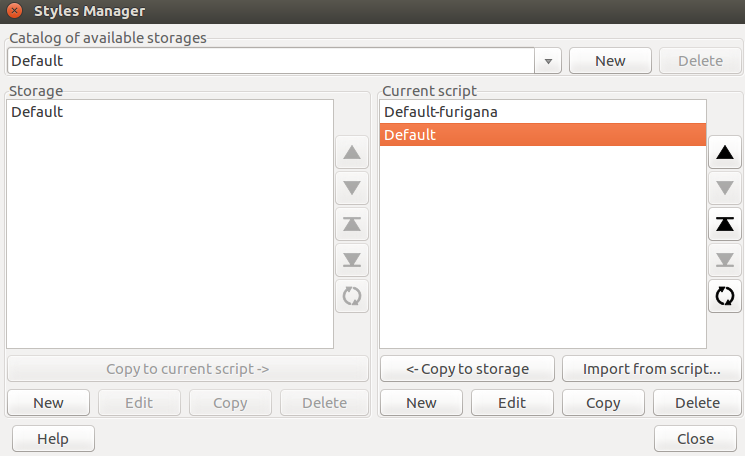
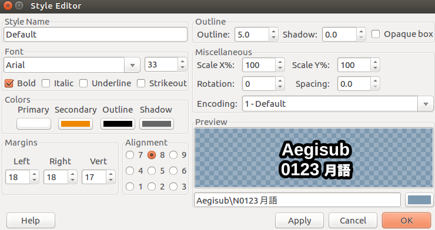
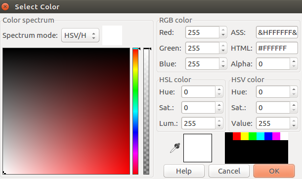
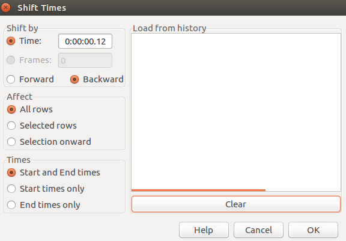
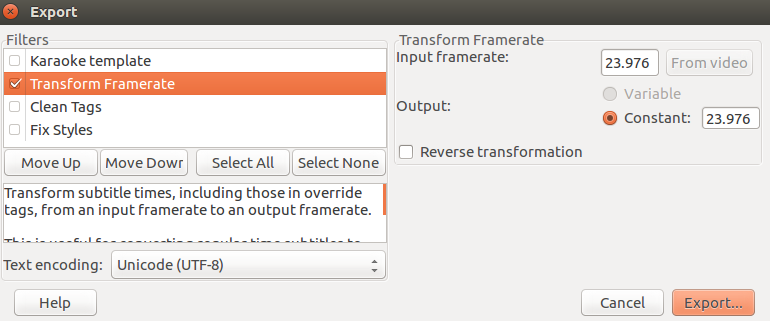

# Les outils et erreurs récurrentes - Fichiers .ass

## Les outils

Vous le savez sans doute déjà, mais le logiciel de référence en création de sous-titres ASS est **Aegisub**. Le logiciel existe aussi bien sur Windows, Mac et Linux, et est la référence en termes de *karaoké*.

Vous avez pu découvrir comment créer un karaoké de A à Z via [le tuto](karaoke.md). Ici, on va s'attarder sur les outils Aegisub utiles au dépannage des sous-titres existants.

### Les paramètres globaux du fichier

Vous pouvez accéder à cette fenêtre via **"Fichier > Propriétés"**. Elle se présente comme suit :

Comme vous le constatez, diverses métadonnées sont renseignables ici. Mais pour nos karaokés, une seule chose est importante : la résolution. En effet, l'affichage de sous-titres au format ASS dépend de styles (que nous allons voir juste après) selon une résolution prédéfinie stockée en paramètres **""PlayresX""** et **"PlayresY"** dans le fichier ASS.

Les différents lecteurs vidéo sont capables de s'adapter selon le delta entre la résolution déclarée et la résolution effective, mais une résolution mal définie peut être source d'erreurs. On déclarera donc la bonne résolution dans les fichiers ASS en cliquant ici sur le bouton **"From video"**... après avoir chargé la bonne vidéo dans Aegisub, évidemment. Pour rappel, cela se fait via **"Video > Ouvrir vidéo"**. Il est aussi possible de glisser-déposer la vidéo.

### Le gestionnaire de styles

Vous pouvez accéder à ce gestionnaire via **"Sous-titres > Gestionnaire de styles"**. La fenêtre suivante s'affichera alors :

Concentrons-nous sur la section **"Script courant"**. Si tout va bien, il devrait n'avoir qu'un style ou deux. Les styles  "-furigana" sont générés par les scripts d'automatismes à partir des styles de base. Mais pas besoin d'y toucher.

En situation de dépannage de subs, s'il y a trop de styles, il ne faut pas hésiter à faire le ménage et en supprimer un maximum. De toute façon, dans la majorité des karaokés de Karaoke Mugen, afin d'assurer la lisibilité des sous-titres, on préférera utiliser le seul style "sample" que vous trouverez dans le dossier ***karaokebase/docs/sample_lyrics***. Pour cela, cliquez sur le bouton **Importer depuis un script** et sélectionnez le fichier correspondant à la résolution la plus proche à celle de votre vidéo courante.

Assurez-vous que toutes les paroles aient leur style placé sur **"Default"**, sinon ben ça n'appliquera pas le style.

À noter que, dans certaines chansons bavardes (notamment en duo), il peut être bienvenu de créer un style secondaire légèrement différent du précédent. Je vous invite pour cela à copier le style "Default" et à le modifier à votre guise, comme nous allons le voir.

#### Modifier un style

Il se peut que vous ayez envie de modifier un style : chanson bavarde en duo, taille trop grande ou trop petite à votre goût... vous êtes à la bonne place ! Pour modifier un style, sélectionnez-le dans le gestionnaire de styles et cliquez sur **"Modifier"**. Vous aurez alors l'écran suivant :

Détaillons chaque champ, voulez-vous ?
  - `Nom du style` : pas besoin de vous expliquer, je pense. Gardez "Default" si vous n'avez qu'un style, ou explicitez selon ce que vous voulez faire. Genre "Default-haut", "Default-choeur", etc.
  - `Police` : ici, vous pourriez changer la police de caractères... mais par pitié, ne le faites pas. Arial est très bien puisqu'installée sur tous les systèmes, en plus d'être lisible. Un peu plus à droite, vous pouvez changer sa taille, par contre. Pratique si vos sous-titres sont trop petits... ou s'ils sont un poil trop gros et que ça fait qu'un sous-titre s'affiche sur deux lignes.
  - `Gras, Italique, Souligné, Barré` : c'est très bien le gras.
  - `Couleur primaire` : la couleur primaire est la couleur de base de l'intérieur de votre sous-titre. Ou dans le cas d'un karaoké, c'est la couleur qui sera affichée après que la syllabe ait été chantée.
  - `Couleur secondaire` : utilisée uniquement dans le cas d'un karaoké, c'est la couleur qui sera affichée avant que la syllabe ne soit chantée.
  - `Couleur de contour` : c'est la couleur qui entourera la base de votre sous-titre. C'est très bien le noir.
  - `Couleur d'ombre` :  c'est la couleur qui donnera une sorte d'ombre à votre sous-titre. C'est optionnel mais parfois utilisé.
  - `Marges` : c'est ce qui évite que votre sous-titre ne soit trop collé à gauche, droite, ou au haut/bas de votre vidéo. C'est possible de jouer un peu avec, mais évitez la valeur 0.
  - `Alignement` : vous pouvez changer l'emplacement par défaut de votre sous-titre, chaque valeur entre 1 et 9 étant affectée à une position conforme à ce qui est montré ici. Le point d'encrage votre sous-titre changera en conséquence.
  - `Contour` : vous pouvez grossir ou rétrécir le contour et/ou l'ombre de vos sous-titres ici.
  - `Divers` : vous pouvez étirer ou contracter vos sous-titres sur l'axe X ou Y en %, définir une rotation globale ou agrandir l'écart entre deux caractères.
  
***Attention, lorsque vous modifiez un style, de bien garder la lisibilité en tête et de ne pas vous faire un trip kikoolol, merci.***
  
#### Changer une couleur

L'écran de changement de couleur est le même que vous cherchiez à changer la principale, la secondaire, celle de contour ou encore celle d'ombre.

Vous pouvez changer la couleur, d'abord avec la réglette puis avec le spectre, ou directement renseigner la définition RGB de la couleur que vous recherchez. À noter qu'il aussi possible de changer le **"Alpha"** de votre couleur, c'est à dire sa transparence. Toutes les couleurs sont définies sur un octet, c'est à dire de 0 à 255 ou de 00 à FF selon que votre définition utilise le système décimal ou hexadécimal. Vous avez aussi une "pipette" à disposition pour récupérer une couleur n'importe où sur votre écran.

Les définitions ASS que l'on utilisera fréquemment sont :
  - `Orange` : **&H0088EF&**
  - `Bleu` : **&HEF9900&**
  - `Rouge` : **&H5555FF&**
  - `Vert` : **&H66EF22&** 

### Le décalage temporel

Une fonction très utile lorsque les sous-titres semblent uniformément décalés par rapport à une vidéo, c'est le décalage temporel. Passage quasi obligatoire en cas de remplacement de vidéo pour une meilleure qualité.

C'est possible d'y accéder via **"Timing > Décalage temporel"**. L'écran suivant apparaît alors :

Il est possible alors de définir la transformation que l'on souhaite appliquer aux sous-titres au 1/100e de seconde près, en avance comme en arrière. C'est aussi possible d'appliquer la transformation à tous les sous-titres ou seulement à une plage présélectionnée, mais aussi de décider d'appliquer la transformation seulement aux temps de début ou de fin, pour rajouter du temps d'affichage.

### Convertir la vitesse des sous-titres

Mais parfois, il arrive que vos sous-titres se désynchronisent petit à petit au fil de la vidéo. Cela est lié aux FPS (frames/images par seconde) de la vidéo, le time ayant été originellement produit sur une vidéo avec un nombre de FPS différent, ce que Aegisub interprète comme une vitesse différente. Il faut donc convertir vos sous-titres.

Les formats les plus courants de FPS en vidéo sont 25 FPS et 23.97 FPS, correspondant au PAL et au NTSC. 

Suivez donc le cheminement suivant :
- **"Fichier -> Exporter sous..."**
- Cochez la case **"Transformation défilement"**
- Indiquez dans **"Défilement d'entrée :"** le nombre de FPS de la vidéo originale (souvent 25 FPS)
- Indiquez dans **"Sortie :"** le nombre d'FPS de la nouvelle vidéo (souvent 23.97 FPS)
- Appuyez ensuite sur **"Export..."** et testez le nouveau karaoké, en n'oubliant pas le décalage temporel !

Si cela ne fonctionne pas dans un sens, essayez toujours dans l'autre. Si les valeurs 25 et 23.97 ne fonctionnent pas, et que vous n'avez aucune idée de la vitesse de la vidéo d'origine, pas de bol ! Va falloir refaire le karaoké.

## Erreurs récurrentes

A compléter en faisant des liens vers les outils au besoin ~