# Tutoriel complet : création et envoi de Karaoké Mugen

Bien le bonjour ! Votre générique préféré n'est pas dans la base Karaoke Mugen et ça vous rend très triste ?

**Deux solutions :** soit vous déposez une *issue* via le [formulaire](https://lab.shelter.moe/Karaokemugen/karaokebase/issues/new) avec le template "*Suggestion de Kara*", et espérez qu'un mécène fasse le travail... Soit vous le réalisez vous-même ! C'est simple, et on va tout vous expliquer dans ce tutoriel. Allez, c'est parti ! :)

## Se préparer

### Installer Aegisub

Pour réaliser des *Karaokés* et même des *sous-titres* de façon générale, vous aurez besoin du logiciel **Aegisub**. Vous pouvez télécharger une **installation complète** *(full install)* ou une **installation portable** *(portable version)* via la page [Téléchargements](http://www.aegisub.org/downloads) du [site officiel](http://www.aegisub.org).

L'**installation portable** est utile quand vous voulez la mettre sur une clé USB et l'utiliser sur n'importe quel ordinateur sans avoir à installer quoi que ce soit. Dans le doute, prenez l'**installation complète**.

### Trouver une bonne source vidéo

Il pourrait être tentant d'inclure dans la base la première vidéo **YouTube** qui passe. Cependant, la qualité n'est pas forcément au rendez-vous, ou bien le titre est tout simplement introuvable. Dans le cas d'*animés* récents, il serait même préférable d'inclure une vidéo qui soit *creditless* (sans texte de générique), et au minimum en 720p. Il vous faudra donc une source DVD / Blu-Ray.

**Plusieurs solutions s'offrent à vous :**

#### Trouver un *rip* sur les interwebs

Faut-il encore présenter [NyaaTorrents](http://nyaa.si) ? Si vous avez un compte [Asian DVD Club](https://asiandvdclub.org), ça peut aussi vous aider. Et globalement, ***Google est votre ami***.

#### Demander aux potos

Si ce n'est pas déjà fait, rejoignez le Discord [*Le Eden de la Nanami*](https://discordapp.com/invite/a8dMYek) ! Et n'hésitez pas à demander aux habitués du canal *#karaoke* s'ils ont la chanson dans leur base personnelle !

#### Faire un rip vous-même : 

Eh ouais, il faut parfois donner de sa personne. Certains DVD & Blu-Ray français contiennent les génériques sans crédits, mais c'est surtout le cas sur les volumes japonais. Il est possible de s'en procurer via [CD Japan](http://www.cdjapan.co.jp), en occasion sur [Mandarake](https://mandarake.co.jp)  ou encore tout bêtement sur [Amazon Japan](http://amazon.co.jp). 

Une fois que vous avez ça, il vous faut un lecteur DVD ou Blu-Ray pour PC, selon le support à ripper *(merci Captain Obvious !)*. 

Pour vous permettre de lire correctement les disques et de copier-coller les flux qui vous intéressent, je vous conseille le logiciel *DVD Fab Passkey* [(site officiel)](http://fr.dvdfab.cn/passkey-lite.htm) ou *MakeMKV* [(site officiel)](http://www.makemkv.com/)

##### Avec DVD Fab

DVD Fab est un logiciel, toujours actif en arrière-plan, qui décode *on-the-fly* (comprendre "à la volée") vos disques vidéo. Après que vous ayez inséré un DVD ou un Blu-Ray protégé dans votre lecteur, il mettra une dizaine de secondes à le déchiffrer.

Vous pourrez ensuite soit le lire directement dans VLC (ou autre lecteur vidéo, je juge pas), soit extraire les flux *m2ts* qui vous intéressent d'un simple copier-coller. Les flux *m2ts* sont situés dans **/BDMV/STREAM/** à partir de la racine de votre disque. N'hésitez pas à identifier les fichiers suivant leur taille, et même à les lire, pour trouver le bon et n'extraire que votre générique fétiche.

**Exemple :** bien que *Kazé* y ait intégré un Karaoké inchantable et non désactivable, l'OP de Chunibyô est le fichier **00005.m2ts** (240Mo) du Blu-Ray français.

##### Avec MakeMKV

L'extraction de votre Blu-Ray ou DVD passe par l'appui sur un simple bouton. **Attention :** par défaut, la durée minimale d'une vidéo est considérée de 120 secondes, et se change dans les options. Comme un générique d'animé dure moins que ça, il faudra aller modifier cette option avant de tenter une extraction sinon *MakeMKV* ne verra pas ce que vous recherchez et ne vous proposera pas d'extraire la vidéo.

La vidéo extraite est un *.mkv* par vidéo. *(Attention à ne pas capturer les épisodes lorsque vous sélectionnez les vidéos à extraire ! Regardez la durée qu'ils font pour deviner s'il s'agit d'un générique).*

##### Dans un cas comme dans l'autre...

Le réencodage est **primordial** car les fichiers extraits de façon brute sont très volumineux. Si on gardait les versions brutes, on aurait une base frôlant le tera-octet très rapidement !

Le disque obtenu et le flux extrait, on va donc le **réencoder** pour le **compresser** un peu, et obtenir un bon vieux fichier **MP4** plutôt qu'un flux *m2ts* ou *VOB*, empacté ou non dans un *MKV*. Y a plusieurs écoles, mais je vous conseille de jeter un œil à [MeGUI](https://sourceforge.net/projects/megui/). 

Vous pouvez aussi utiliser [Handbrake](https://handbrake.fr/) ou si la ligne de commande ne vous effraie pas, [FFMpeg](https://www.ffmpeg.org/).

### Trouver les "vraies" paroles

Sujet plus délicat qu'il n'y paraît, tant les transcriptions à l'oreille foisonnent sur Internet. Si plusieurs sources fiables sont d'accord entre elles, on peut se dire que c'est bon. Autrement, il va falloir mener des enquêtes approfondies : bien souvent, en faisant soi-même une transcription à partir du livret officiel du CD où la chanson est parue. L'exercice peut être fastidieux si vous n'avez jamais appris vos kanas japonais, mais reste faisable à l'aide de ce tableau :

Si vous ne reconnaissez pas un kanji, le site [Japanese character recognition](http://maggie.ocrgrid.org/nhocr/) peut vous aider à le OCR ("numériser") pour le passer dans Google Traduction ou autre.

***Attention à bien respecter ces règles sur la romajisation des paroles :***

* Dans un Karaoké japonais, les mots non japonais doivent être mis en majuscules pour bien les différencier.
* Les particules doivent être retranscrite wa, wo, he (et non wa, o, e).
* Les voyelles longues comme "ou" sont notées ainsi et non avec un macaron ou un accent circonflexe.
* Ne pas mettre de majuscules au début des phrases (sauf dans un karaoke non japonais).
* Ne pas mettre de ponctuation.
* Mettre une majuscule pour les noms propres.

### Nommer son matériel

Vous devez maintenant avoir une vidéo et un fichier texte correspondant aux paroles de cette dernière. Le nommage de tous vos fichiers concernera le titre et le nom de la chanson.

Le format est le suivant : 

***Langue - Série/oeuvre - Type - Titre***

Exemple : **JAP - Macross Frontier - OP2 - LION**

Pour les Karaokés de clips musicaux / PV, la partie "*Série/œuvre*" devient "*Nom du groupe*".

Exemple : **FR - Les Inconnus - MV - Vice et versa**

* La langue est en MAJSUCULES, sur 2 à 3 caractères. Elle permet de s'y retrouver dans la liste des fichiers. Celles déjà en place :
    * ALL : allemand
    * ANG : anglais
    * CHI : chinois
    * COR : corréen
    * EPO : espéranto
    * ESP : espagnol
    * FIC : fictive (langue qui n'existe pas)
    * FR : français
    * HEB : hébreu
    * ITA : italien
    * JAP : japonais
    * LAT : latin
    * POR : portugais
    * RUS : russe
    * SUE : suèdois
    * *Enrichissez ce document si vous ajoutez de nouvelles langues !*
    
* Le nom de la série doit obligatoirement être un nom facilement reconnaissable. Il faut préférer le nom international s'il existe, ou un nom facilement connu du public. Exemple, si je vous parle de *Spice & Wolf*, ne soumettez pas votre kara sous le nom *Ôkami to Kôshinryô* sous peine de cassage de genoux. Personne ne connaît cet animé sous ce titre. Pareil avec *FullMetal Alchemist* qu'il n'y a pas besoin d'écrire en japonais "*Hagane no Renkinjutsushi*" parce que PERSONNE de sensé n'irait taper ça dans un moteur de recherche, bande d'élitistes.
    * Par contre, *Suzumiya Haruhi no Yuutsu* est toléré, car "Suzumiya Haruhi" est facilement reconnaissable et connu du public. Même chose pour *Kidou Senki Gundam*.
    * Si vous avez ajouté une nouvelle série, mettez à jour le fichier **series_altnames.csv** dans le dossier racine ! Il contient la liste des noms alternatifs des séries. Par exemple le nom japonais de *FullMetal Alchemist* peut être indiqué dans ce fichier. Cela permet au moteur de recherche de Karaoké Mugen de retrouver la série en japonais.
* Le type du karaoké peut être l'un des suivants :
    * `AMV` : Anime Music Video. Peut être utilisé pour des clips musicaux tout en animation.
    * `CM` : Publicité.
    * `ED` : Ending d'un animé.
    * `IN` : Insert song.
    * `OT` : Autre/inclassable.
    * `TRAILER` : Vidéo promotionnelle (trailer, bande-annonce, etc.).
    * `LIVE` : Concerts.
    * `OP` : Opening d'un animé.
    * `MV` : Vidéo musicale (clips musicaux).
* Le numéro de générique : le premier générique d'ouverture sera qualifié d'OP1, etc. 
    * S'il n'y a qu'un seul générique tout le long de la série ou saison, on omet le numéro et on met simplement OP ou ED selon le cas.
    * Attention toutefois : il arrive souvent, notamment en début de série, que des génériques d'ouverture servent exceptionnellement de générique de clôture. Il ne faut pas pour autant qualifier cet OP d'ED1 et l'ED classique d'ED2 ! Exemple avec la série *Kekkai Sensen*, qui n'a qu'un OP et un ED : l'OP sert d'ED au premier épisode, mais le générique d'ouverture doit ête taggé OP et le générique de clôture ED, et ne pas mettre "ED2" pour le générique de fin 'classique' sous prétexte qu'il y a eu un autre générique pour un seul épisode.
* Le titre de la chanson, si vous l'avez. Respectez le plus possible son nom (sauf s'il contient des caractères spéciaux qui sont interdits dans les noms de fichier.)
	- Pour les caractères spéciaux, trouvez des équivalents avec de vrais caractères lisibles par n'importe quel clavier. Exemples :
		- Les signes de ponctuation ?, :, ; ou encore /. De toutes façons votre système d'exploitation vous l'interdira la plupart du temps.
		- Le signe de ponctuation ! est aussi vivement déconseillé.
		- Le symbole mathématique delta (𝚫) de Macross Delta
		- Le symbole mathématique multiplier (×) couramment utilisé dans beaucoup de titres de séries comme Kiss × Sis peut être remplacé par un simple x (la lettre x comme dans xylophone).

**NOTE :** Si vous tenez absolument à retranscrire les caractères spéciaux, indiquez-les à l'intérieur du fichier .kara (voir plus bas)

## Se lancer

### Réaliser le karaoké en lui-même 

#### L'espace de travail

En ouvrant **Aegisub**, vous tombez tout d'abord sur une interface quasiment vide. Avant de se mettre au boulot, il faut la remplir.

Tout d'abord, allez dans **"Vidéo > Ouvrir une vidéo"**, et sélectionnez votre vidéo pour l'ouvrir. Puis, ouvrez votre fichier texte via **"Fichier > Ouvrir des sous-titres"** ou le bouton .

Vous devriez donc avoir un écran similaire au mien, où je suis en train de réaliser le Karaoké de l'OP2 de *BTOOOM!*

**Il peut y avoir deux différences, en rapport avec l'audio :**

* Si vous n'avez pas la bande audio en haut à droite de l'écran, et si vous n'avez pas de son en jouant votre vidéo via le bouton , alors le son n'est pas chargé. Remédiez-y via **"Audio > Ouvrir l'audio de la vidéo"**.

* Si vous n'avez pas le même type de bande audio, c'est normal ! Et je vous conseille d'y remédier en cliquant sur l'icône 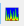. Ce type de représentation est plus explicite.

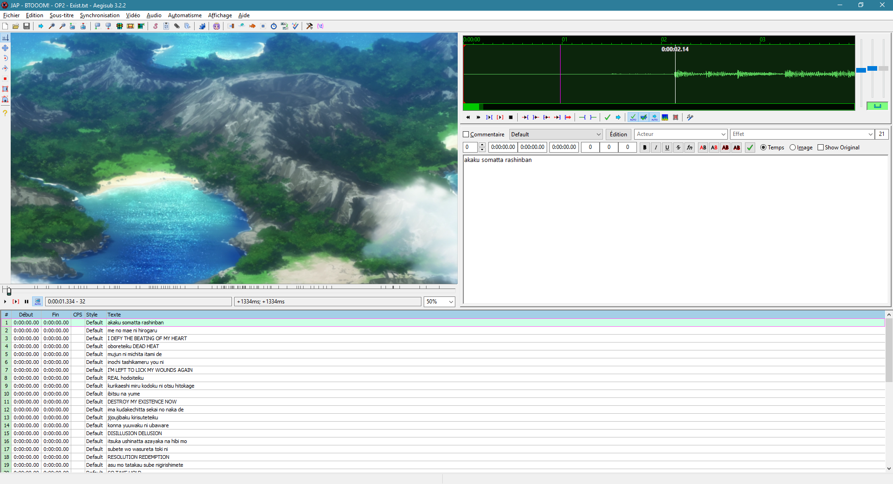

Si tout est bon, faites **"Fichier > Enregistrer les sous-titres sous..."** afin de créer un fichier *ASS* (sous-titres) et non plus de *texte plat*. Nommez votre fichier *ASS* avec le même nom que choisi précédemment pour votre karaoké. Par exemple **JAP - Macross Frontier - OP2 - LION.ass**

#### Les styles de sous-titres

Il vous faudra ensuite intégrer le "style" de sous-titres *Karaoke Mugen* à votre script. Pour cela, l'idéal est de commencer par définir la résolution de la vidéo au sein du script en allant dans le menu **"Fichier > Propriétés"**, puis de cliquer sur le bouton **"De la vidéo"**.

Retournez ensuite sur Lab Shelter dans [**/docs/samples_lyrics/**](https://lab.shelter.moe/Karaokemugen/karaokebase/tree/master/docs/sample_lyrics) pour télécharger le script correspondant à votre résolution de vidéo, si vous ne l'avez pas déjà sur votre machine.

Ensuite, allez dans **"Sous-titres > Gestionnaires de style"**. Cliquez sur **"Importer depuis un script"** et sélectionnez le fichier téléchargé correspondant à votre résolution. Importez le style **"Default"** en cochant la case à sa gauche puis en cliquant sur **"OK"**, confirmez que vous voulez *remplacer le style existant*, et c'est bon !

***Si la résolution sur laquelle vous voulez travailler n'est pas disponible, n'hésitez pas à le signaler sur le Discord !***

Autrement, sélectionnez la résolution la plus proche et vous ajusterez légèrement le style Default plus tard, lorsque vos sous-titres seront presque prêts. Pour cela, dans le **Gestionnaire des Styles**, sélectionnez le style **"Default"** et cliquez sur **"Edition"**.

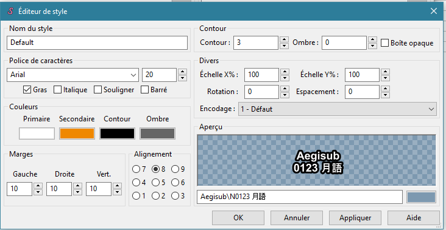

Laissez les paramètres **"Divers"**, notamment les **"Échelle X%"** et **"Échelle Y%"** qui doivent rester à 100 sous peine d'être rattrapé par la police du bon goût. En revanche, pour adapter votre style à une résolution un peu exotique, n'hésitez pas à changer la taille de la police, mais également celle du contour afin que votre Karaoké reste lisible.

Ce menu peut également vous servir si l'une de vos paroles se retrouve sur deux lignes à un poil d'image près.

#### La synchronisation "simple" (ou *timing*)

On est prêts pour bosser ! Pour toute cette étape, je vous conseille de désactiver le *"Replçage automatique du curseur vidéo au temps de début de la ligne active"* en cliquant sur le bouton 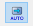. Ça vous évitera la crise de nerfs.

Le but de cet étape est de synchroniser chaque *ligne* de paroles à l'écran. On ne s'occupera du syllabe-par-syllabe qu'ensuite.

***J'aimerais attirer votre attention sur trois éléments de la "box sous-titres" :***

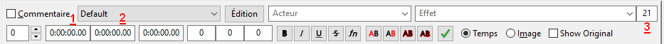

*(1) : le temps de début d'apparition de votre sous-titre.*

*(2) : le temps de fin d'apparition de votre sous-titre.*

*(3) : le "CPS" (Character Per Second) de votre sous-titre : le nombre de caractères de votre sous-titre divisé par le nombre de secondes. Il doit être TOUJOURS inférieur à 15.*

Vous l'aurez compris, le but de cet étape, c'est grosso-merdo de renseigner le temps de début d'apparition et de fin d'apparition du sous-titre, en respectant le CPS.

***Une règle fondamentale du Karaoké Karaoke Mugen est que le Karaoké doit être lisible : ainsi, une ligne de sous-titres apparaîtra  ~1s avant qu'elle ne commence à être chantée.***

*Pour résumer, afin de renseigner chaque ligne, vous allez :*

1°) Lire votre vidéo via le bouton  en-dessous de la prévisualisation de celle-ci, et faire pause avec . Juste à droite du bouton .

2°) Vous aurez alors l'information concernant le temps où vous avez fait pause, sous le format *"heure:minute:seconde:centièmeSeconde"*. Recopiez ce temps auquel vous aurez soustrait une seconde dans le "*Temps de début*" de votre ligne concernée. 

3°) Reprenez ensuite la lecture et faites pause peu après la fin du chant de votre ligne courante.

4°) Recopiez le temps où vous avez pause dans le "*Temps de fin*" de votre ligne concernée. 

5°) Sélectionnez la ligne suivante et continuez progressivement votre lecture jusqu'à synchroniser toutes vos lignes ! 

**Notez que si vous progressez trop vite dans votre lecture, le bouton 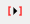 vous permet de recommencer la lecture à partir du temps de début d'une ligne. Pratique si vous avez des difficultés avec le curseur sous la prévisualisation de la vidéo ! Vous pouvez aussi utiliser les flèches gauche et droite de votre clavier, qui par défaut vous font respectivement reculer et avancer d'une image au sein de votre vidéo.**

*Si vous êtes un poil perfectionniste, une fois votre synchronisation terminée, vous pouvez utiliser les astuces ci-dessus afin d'ajuster votre premier jet via les "timeplans" : il s'agit de synchroniser les changements de plans de la vidéo avec les sous-titres, le cas échéant. Ça peut éviter des maux de crâne à vos spectacteurs les plus sensibles. L'idée est donc de lire chacun de vos sous-titres, et d'ajuster les temps pour correspondre à l'image près à un changement de plan si cela est possible sans perdre l'avance d'une seconde qui est bien plus importante !*

#### La synchronisation "par syllabe" (ou *time en k*)

C'est bon, toutes vos lignes sont synchronisées au petits oignons ? Parfait, le vrai *fun* commence ! Car un vrai Karaoké, c'est aussi guider vos potes qui ne connaissent pas la chanson, il est temps de réaliser la synchronisation syllabe-par-syllabe de vos lignes !

**L'idée**, c'est d'afficher d'abord votre ligne de sous-titre en orange, puis de mettre les syllabes en blanc au rythme de la chanson. Pour ça, on va utiliser des **balises**, ou plus précisément des balises ***{\k}***. Si vous êtes un newbie complet en informatique, je vous laisse consulter la [page Wikipédia](https://fr.wikipedia.org/wiki/Langage_de_balisage) qui saura mieux vous définir que moi ce qu'est une balise.

Chaque syllabe de nos lignes de Karaokés sera donc séparée par une balise {\kX}, où "X" est le nombre de centièmes de seconde s'écoulant avant l'affichage en orange de tout le texte suivant la balise, et ce jusqu'à la suivante (le cas échéant). Concrètement, ça signifie que ma première ligne de Karaoké va passer de "**akaku somatta rashinban**" à quelque chose comme ""**{\k92}{\k11}a{\k26}ka{\k19}ku {\k24}so{\k24}mat{\k23}ta {\k11}ra{\k23}shi{\k28}n{\k23}ba{\k13}n**".

**Ne prenez pas peur !** Je vous vois imaginer devoir mesurer avec minutie chaque centiseconde de chaque parole, mais n'ayez crainte : Aegisub dispose d'un **Assistant Karaoké** ! Et on va l'activer immédiatement en appuyant sur .

Vous constaterez alors deux changements dans votre interface, en haut à droite : votre texte apparaît maintenant mot-par-mot sur votre spectre sonore, et ce même texte pré-découpé apparaît en bas du-dit spectre. Vous remarquerez au passage qu'il est possible d'effectuer un zoom horizontal et/ou vertical du spectre via les ascenseurs à droite de ce dernier. N'hésitez pas à en abuser selon le contexte.

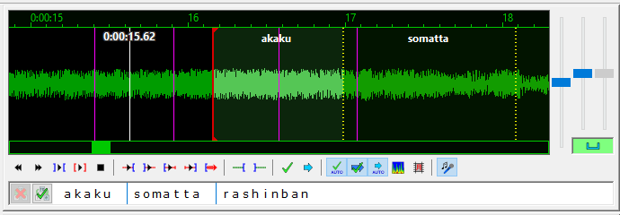

La première étape pour *timer en k* une ligne via l'assistant Karaoké, c'est **délimiter les syllabes**. Pour ça, on va concentrer sur notre ligne recopiée en-dessous du spectre audio. Si vous placez votre souris dessus, vous verrez un curseur sur le long de la case. C'est donc sur cette partie de l'écran que vous délimiterez les syllabes, en cliquant à chaque intersection vous semblant nécessaire.

Quelques règles pour se faire :

* Dans le cas de Karaokés japonais, on entend par "syllabe" l'équivalent d'un Kana (voir tableau plus haut).

* Dans le cas de lettres dédoublées *(ex : somatta)*, deux solutions selon ce qu'on entend : soit on découpe **"so | mat | ta"** si on estime que le "*a*" n'est pas prononcé deux fois, soit **so | ma | t | ta** dans le cas inverse. Le "*t*" seul servira alors à marquer la 2e prononciation du a.

* On peut admettre que certaines syllabes sont parfois difficiles à distinguer les unes des autres. Ne pas hésiter, dans certains cas, à en englober deux d'un coup (ex : **"shin"** devrait être découpé en **"shi | n"** mais on peut admettre que non).

* ***IMPORTANT :*** il faut placer une découpe tout au début de votre phrase pour représenter la seconde "d'attente" avant que votre phrase ne commence à être chantée. On y reviendra.

*Allez, un petit exemple pour la route :* 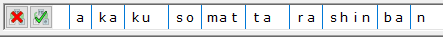

Une fois que votre découpe vous satisfait, vous pouvez cliquer sur 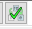. En revanche, si vous vous trompez sur une seule découpe, vous êtes obligé d'effacer l'intégralité de la découpe de la ligne via .

Une fois validé, vous voyez quelques changements sur l'interface : le découpage syllabique est effectué sur le spectre, là où vous l'avez effectué plus tôt, et des balises **{\k}** ont été générées avec des temps plus ou moins aléatoires.

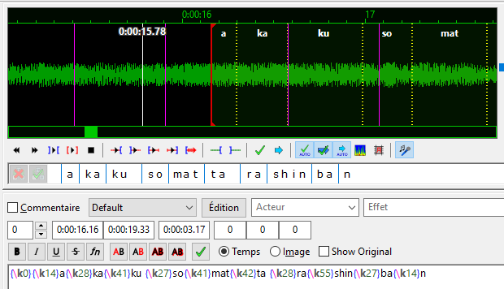

La première chose à faire alors, c'est de modifier manuellement la première balise *k* via l'interface texte, et la passer de **"{\k0}"** à **"{\k100}"** Ou une valeur différente, si vous avez fait le malin. **L'astuce**, c'est de retirer ensuite un peu plus de cent centièmes de seconde à toutes les balises suivantes, puisque Aegisub a généré des temps aléatoires pour un total correspondant tout de même à la durée de la ligne active.

Ensuite, il ne vous reste plus qu'à, à l'oreille via les boutons ,  et  que vous connaissez déjà par cœur, et via le spectre audio... À faire joujou avec les lignes jaunes pointillées du spectre pour faire correspondre chaque zone de ce dernier à une syllabe ! Notez qu'une barre blanche s'affiche lors de la lecture pour vous indiquer ou en est la vidéo, mais qu'elle ne reste malheureusement pas affichée lors de la pause.

Cette étape est longue et laborieuse, et vous ne serez pas forcément en rythme lors de vos premières réalisations, mais ne perdez pas espoir : la rapidité comme la précision viennent à force d'entraînement. Promis juré, petit scarabée.

##### Pour les Karaokés non-japonais

Les langues latines ayant des coupes moins franches au niveau du découpage par syllabe, il se peut que vous préfériez un remplissage "progressif" de la couleur blanche sur la couleur orange. Parfait : la balise **{\kf}** est là pour ça !

Une fois l'intégralité de votre Karaoké timé selon le processus ci-dessus, allez dans **"Edition > Rechercher et remplacer"**, et cherchez **"{\k"** (oui oui, sans fermer le crochet) pour le remplacer par **"{\kf"** (idem, ne fermez pas le crochet). Cliquez sur **"Remplacer tout"** et hop, la magie opère et votre Karaoké a désormais un remplissage syllabique progressif ! C'est beau.

#### Autres types de balises

Si vous corrigez certains Karaokés, vous pourrez trouver d'autres balises. La liste ci-dessous répertorie les plus fréquentes et n'est en rien exhaustive. Contrairement à celle du [site officiel Aegisub (en anglais)](http://docs.aegisub.org/3.2/ASS_Tags/).

* **{\fad(xxx,yyy)}** : cette balise indique un temps d'apparition et/ou disparition progressif du texte le suivant. **"xxx"** étant le temps d'apparition et **"yyy"** le temps de disparition. Les temps sont une fois encore, en centièmes de seconde.

* **{\anX}** : cette balise change le "point d'attache" des lignes de sous-titres. Le point d'attache est originellement défini dans le style de la ligne active, mais peut aussi être changé au sein de celle-ci via cette balise. "X" dépend de là où vous voulez faire appararaître votre sous-titre, selon la grille ci-dessous. Dans le style Karaoke Mugen, il est par défaut *8*, mais ce peut être différent sur de vieux Karaokés !

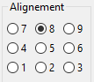

* ***Liste à compléter au fil des demandes récurrentes***

### Testez votre Karaoké

Ouvrez votre lecteur favori et chargez votre vidéo, puis demandez à charger les sous-titres en ajoutant une piste de sous-titre à votre lecteur. Cela vous permettra de tester une dernière fois avant de l'exploiter au sein de Karaoke Mugen.

### Envoyer votre Karaoké (ou pas)

Vous avez la possibilité de partager avec la base *Karaoke Mugen* mais il n'y a aucune obligation à cela. Vous pouvez très bien utiliser votre Karaoké pour vous et c'est tout.

Vous pouvez l'envoyer via [cette page](http://leafa.mahoro-net.org/karaoke-mugen). Un gentil administrateur contrôlera alors votre Karaoké, et si vous avez bien rempli le formulaire, il sera tout propre pour une utilisation dans *Karaoke Mugen*.

Quelques infos sur comment remplir les cases :

* **Pseudo** : Il s'agit de votre pseudo à vous.
* **Vidéo** et **Sous-titre** : Choisissez votre vidéo et votre fichier *ASS* sur votre ordinateur.
* **Langue** : Choisissez la langue du karaoké. Si la langue ne figure pas, contactez quelqu'un sur le Discord [*Le Eden de la Nanami*](https://discordapp.com/invite/a8dMYek).
* **Langue supplémentaire** : Si votre karaoké est en plusieurs langues, comme par exemple l'opening de *Oban Star Racers*, alors précisez-le ici.
* **Type** et **Ordre** : Choisissez un type ainsi qu'un numéro.
* **Titre de l'animé/série/groupe** : Ça devrait être évident.
* **Titre de la chanson** : Ça aussi je crois.
* **Année** : L'année de l'animé, ou de la chanson s'il s'agit d'un karaoké de clip musical.
* **Chanteur** : Le nom du chanteur si vous l'avez. L'ordre est "**prénom** puis **nom**".
* **Tags** : Indiquez des infos supplémentaires : s'il s'agit d'un jeu vidéo, d'un tokusatsu/sentai, etc. Vous pouvez ajouter plusieurs tags en les séparant d'un point-virgule, "**;**".

* Une liste non exhaustive de tags :
	* TAG_SPECIAL : Spécial
	* TAG_VOICELESS : Karaoké sans voix (si si)
	* TAG_GAMECUBE : Gamecube
	* TAG_TOKU : Tokusatsu/Sentai
	* TAG_OVA : OAV
	* TAG_MECHA : Animé de méchas
	* TAG_CONCERT : Concert
	* TAG_PARODY : Parodie
	* TAG_HUMOR : Humour
	* TAG_ANIME : Anime
	* TAG_REAL : Non-animé
	* TAG_VIDEOGAME : Jeu vidéo
	* TAG_MOVIE : Film
	* TAG_TVSHOW : Série
	* TAG_SPOIL : Spoilers
	* TAG_LONG : Long (plus de 5 minutes)
	* TAG_PS2 : PS2
	* TAG_PS3 : PS3
	* TAG_PSV : PSVita
	* TAG_PSX : PSOne
	* TAG_PSP : PSP
	* TAG_R18 : Pour adultes
	* TAG_VOCALOID : Vocaloid
	* TAG_XBOX360 : XBOX 360
	* TAG_PC : PC
	* TAG_SEGACD : Mega CD
	* TAG_REMIX : Remix (version alternative, parodique le plus souvent)

Consultez la [documentation sur le format des .kara](karaformat.md) pour une liste complète.

* **Compositeur / parolier** : C'est évident. Toujours "**prénom** puis **nom**".
* **Studio d'animation / origine** : Pour un animé, il s'agit d'un studio d'animation, sinon on précise le nom de la boîte de production qui a crée le clip, par exemple.
* **Auteur** : L'auteur du karaoké. Cela peut être vous ou pas, si vous envoyez le kara de quelqu'un d'autre. Il sera ajouté dans le fichier .kara pour référence en tant qu'auteur du karaoké.

Une fois que vous avez choisi d'envoyer, il n'y a plus qu'à attendre que quelqu'un mette à jour la base de Karaokés !

## La bonne grosse FAQ

* ***À compléter au fil des questions posées :D***